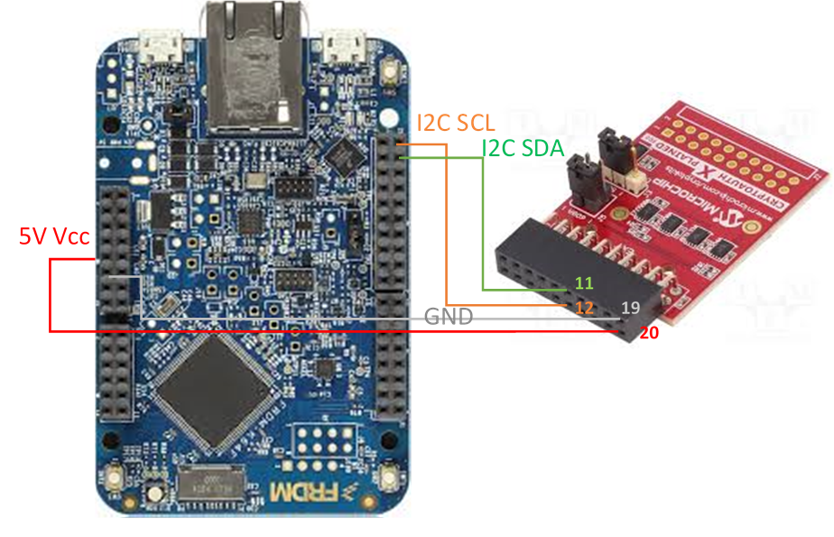
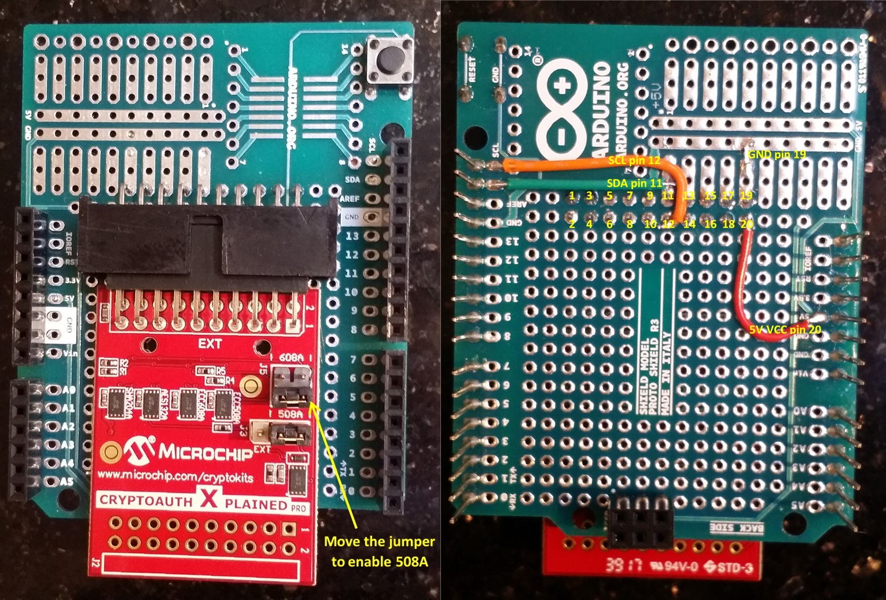

# Mbed OS Examples for the ATECC608A secure element

The examples in this repository demonstrate how to use the ATECC608A secure element with Mbed OS. The `atecc608a` example demonstrates use of the ATECC608A with Mbed Crypto. Examples of how to generate a certificate using pre-provisioned ATECC608A keys and how to use ATECC608A with Mbed TLS are yet to come.

<span class="notes">**Note:** To see a rendered example you can import into the Arm Online Compiler, please see our [quick start](https://os.mbed.com/docs/mbed-os/latest/quick-start/online-with-the-online-compiler.html#importing-the-code).</span>

## Prerequisites

* [Install Mbed CLI](https://os.mbed.com/docs/mbed-os/latest/tools/installation-and-setup.html).

* [Install the arm-none-eabi-ggc toolchain](https://developer.arm.com/tools-and-software/open-source-software/developer-tools/gnu-toolchain/gnu-rm/downloads).
  - The [cryptoauthlib](https://github.com/MicrochipTech/cryptoauthlib) which
    this example depends on [does not build on
    IAR](https://github.com/ARMmbed/mbed-os-example-atecc608a/issues/15),
    [ARMC5 or
    ARMC6](https://github.com/ARMmbed/mbed-os-example-atecc608a/issues/16).

* A target with I2C and power supply connections, connected to an ATECC608A secure element as shown in [Hardware interface](#hardware-interface).


## Importing the example

From the command-line, import the example:

```sh
git clone git@github.com:ARMmbed/mbed-os-example-atecc608a.git
cd mbed-os-example-atecc608a/atecc608a
mbed deploy
```

## Compiling and running the example

Invoke `mbed compile`, and specify the name of your platform and your toolchain
(only `GCC_ARM` works at the moment). For example, for the GCC_ARM compiler:

```sh
mbed compile -t GCC_ARM -m K64F --flash --sterm
```

Your PC may take a few minutes to compile your code. At the end, you see the following result:

```
Image: ./BUILD/K64F/GCC_ARM/atecc608a.bin
--- Terminal on /dev/ttyACM0 - 9600,8,N,1 ---
Serial Number:
01 23 BA CF BA D3 29 CA EE

Config zone: 01 23 BA CF 00 00 50 00 BA D3 29 CA EE C0 3D 00
C0 00 55 00 83 20 83 20 83 20 83 20 83 20 83 20
83 20 83 20 00 00 00 00 00 00 00 00 00 00 00 00
00 00 AF 8F FF FF FF FF 00 00 00 00 FF FF FF FF
00 00 00 00 FF FF FF FF FF FF FF FF FF FF FF FF
FF FF FF FF 00 00 00 00 FF FF 00 00 00 00 00 00
13 00 13 00 13 00 13 00 13 00 13 00 13 00 13 00
1C 00 10 00 10 00 10 00 10 00 10 00 10 00 1C 00

--- Device locks information ---
  - Config locked: 1
  - Data locked: 1
  - Slot 0 locked: 0
  - Slot 1 locked: 0
  - Slot 2 locked: 0
  - Slot 3 locked: 0
  - Slot 4 locked: 0
  - Slot 5 locked: 0
  - Slot 6 locked: 0
  - Slot 7 locked: 0
  - Slot 8 locked: 0
  - Slot 9 locked: 0
  - Slot 10 locked: 0
  - Slot 11 locked: 0
  - Slot 12 locked: 0
  - Slot 13 locked: 0
  - Slot 14 locked: 0
  - Slot 15 locked: 0
--------------------------------

Private key slot in use: 1, public: 9
Running tests...
test_hash_sha256 succesful!
test_sign_verify succesful!
test_export_import succesful!
test_psa_import_verify succesful!
test_write_read_slot succesful!


Available commands:
 - info - print configuration information;
 - test - run all tests on the device;
 - exit - exit the interactive loop;
 - generate_private[=%d] - generate a private key in a given slot (0-15),
                           default slot - 0.
 - generate_public=%d_%d - generate a public key in a given slot
                           (0-15, second argument) using a private key
                           from a given slot (0-15, first argument);
 - private_slot=%d - designate a slot to be used as a private key in tests;
 - public_slot=%d - designate a slot to be used as a public key in tests;
 - write_lock_config - write a hardcoded configuration to the device,
                       lock it;
 - lock_data - lock the data zone;
```

## Hardware interface

A couple of evaluation and development kits are available for the ATECC608A secure element.
To interface with an Mbed platform, you have to make I2C and power supply connections. Note that ATECC508A requires a 5V supply.

This is an example of how to connect an
[ATCRYPTOAUTH-XPRO-B](http://www.microchip.com/DevelopmentTools/ProductDetails.aspx?PartNO=ATCRYPTOAUTH-XPRO-B)
([header](http://ww1.microchip.com/downloads/en/DeviceDoc/CryptoAuth-XPRO-B_design_documentation.pdf))
and a K64F:



For secure connections, you can prepare a shield with ATCRYPTOAUTH-XPRO-B. Most
Mbed platforms support Arduino headers, and you can use an [Arduino
shield](https://store.arduino.cc/usa/arduino-mega-proto-shield-rev3-pcb) to prepare a shield to connect ATCRYPTOAUTH-XPRO-B to an Mbed platform.

This image shows an ATCRYPTOAUTH-XPRO-B on an Arduino shield:



<span class="notes">**Note:** ATCRYPTOAUTH-XPRO-B comes with ATECC508A and ATECC608A integrated circuits (ICs). Use the J5 jumper to enable ATECC508A.</span>

## License and contributions

The software is provided under Apache-2.0 license. Contributions to this project are accepted under the same license. Please see [contributing.md](./CONTRIBUTING.md) for more info.

This project contains code from other projects. The original license text is included in those source files. They must comply with our [license guide](https://os.mbed.com/docs/mbed-os/v6.2/contributing/license.html)
